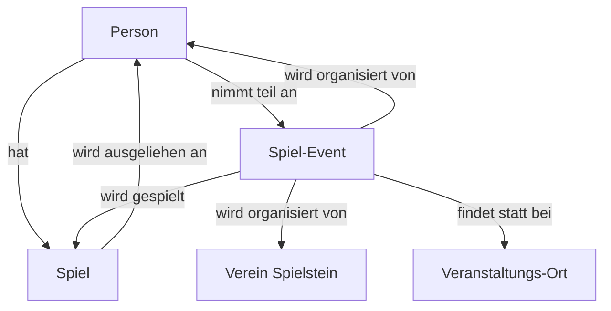
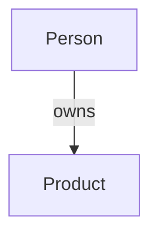

# Idee

Unsere Idee einfach dargestellt ;-).

# Model


## Schema.org




## Notizen von Ideen

* QR-Code Scann mit direkt Link zu den Spiel-Daten bspw. https://spielstein.ch/spiele/dorfromantik/


## Beispeil

#### Typ Produkt und Game
``` json
{
  "@context": "https://schema.org",
  "@type": ["Product", "Game"],
  "name": "Catan",
  "category": "Board Game",
  "image": "https://example.com/images/catan.jpg",
  "description": "Ein beliebtes Brettspiel, bei dem Spieler Siedlungen bauen und handeln.",
  "manufacturer": {
    "@type": "Organization",
    "name": "Kosmos"
  },
  "numberOfPlayers": {
    "@type": "QuantitativeValue",
    "minValue": 3,
    "maxValue": 4
  },
  "gameItem": {
    "@type": "Thing",
    "name": "Spielbrett"
  },
  "additionalProperty": {
    "@type": "PropertyValue",
    "name": "Stückzahl",
    "value": "3"
  }
}
```

#### Besitzer diese Produkt
``` json
{
  "@context": "https://schema.org",
  "@type": "Person",
  "name": "Max Mustermann",
  "owns": {
    "@type": "OwnershipInfo",
    "typeOfGood": {
      "@type": ["Product", "Game"],
      "name": "Catan",
      "category": "Board Game",
      "image": "https://example.com/images/catan.jpg",
      "description": "Ein beliebtes Brettspiel, bei dem Spieler Siedlungen bauen und handeln.",
      "additionalProperty": {
        "@type": "PropertyValue",
        "name": "Stückzahl",
        "value": "3"
      }
    },
    "ownedFrom": "2023-01-01T00:00:00Z",
    "ownedThrough": "2024-01-01T00:00:00Z"
  }
}
```

#### Anzahl der Produkte via Offers

``` json
{
  "@context": "https://schema.org",
  "@type": ["Product", "Game"],
  "name": "Catan",
  "category": "Board Game",
  "image": "https://example.com/images/catan.jpg",
  "description": "Ein beliebtes Brettspiel, bei dem Spieler Siedlungen bauen und handeln.",
  "offers": {
    "@type": "Offer",
    "inventoryLevel": {
      "@type": "QuantitativeValue",
      "value": 3
    }
  }
}
```

#### Stückzahl pro Besitzer/Anbieter
``` json
{
  "@context": "https://schema.org",
  "@type": "Person",
  "name": "Max Mustermann",
  "owns": {
    "@type": "OwnershipInfo",
    "typeOfGood": {
      "@type": ["Product", "Game"],
      "name": "Catan",
      "category": "Board Game",
      "image": "https://example.com/images/catan.jpg",
      "description": "Ein beliebtes Brettspiel, bei dem Spieler Siedlungen bauen und handeln."
    },
    "ownedFrom": "2023-01-01T00:00:00Z",
    "ownedThrough": "2024-01-01T00:00:00Z",
    "offers": {
      "@type": "Offer",
      "seller": {
        "@type": "Person",
        "name": "Max Mustermann"
      },
      "inventoryLevel": {
        "@type": "QuantitativeValue",
        "value": 3
      }
    }
  }
},
{
  "@context": "https://schema.org",
  "@type": "Organization",
  "name": "Brettspiel GmbH",
  "owns": {
    "@type": "OwnershipInfo",
    "typeOfGood": {
      "@type": ["Product", "Game"],
      "name": "Catan",
      "category": "Board Game",
      "image": "https://example.com/images/catan.jpg",
      "description": "Ein beliebtes Brettspiel, bei dem Spieler Siedlungen bauen und handeln."
    },
    "ownedFrom": "2023-01-01T00:00:00Z",
    "ownedThrough": "2024-01-01T00:00:00Z",
    "offers": {
      "@type": "Offer",
      "seller": {
        "@type": "Organization",
        "name": "Brettspiel GmbH"
      },
      "inventoryLevel": {
        "@type": "QuantitativeValue",
        "value": 10
      }
    }
  }
}
```